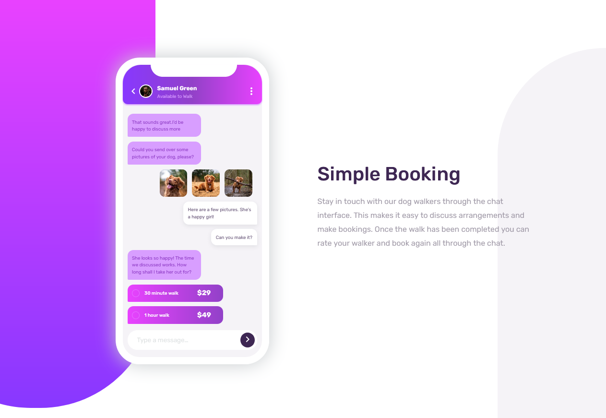

# Frontend Mentor - Chat app CSS illustration solution

This is a solution to the [Chat app CSS illustration challenge on Frontend Mentor](https://www.frontendmentor.io/challenges/chat-app-css-illustration-O5auMkFqY). Frontend Mentor challenges help you improve your coding skills by building realistic projects. 

## Table of contents

- [Overview](#overview)
  - [The challenge](#the-challenge)
  - [Screenshot](#screenshot)
  - [Links](#links)
- [My process](#my-process)
  - [Built with](#built-with)
  - [What I learned](#what-i-learned)
  - [Continued development](#continued-development)
  - [Useful resources](#useful-resources)
- [Author](#author)
- [Acknowledgments](#acknowledgments)

**Note: Delete this note and update the table of contents based on what sections you keep.**

## Overview

### The challenge

Users should be able to:

- View the optimal layout for the component depending on their device's screen size
- **Bonus**: See the chat interface animate on the initial load

### Screenshot




### Links

- Solution URL: [Add solution URL here](https://your-solution-url.com)
- Live Site URL: [Add live site URL here](https://your-live-site-url.com)

## My process

### Built with

- Semantic HTML5 markup
- CSS custom properties
- Flexbox (on small size sections)
- CSS Grid (on large sections)
- Mobile-first workflow
- Google Material Icons


### What I learned

I have learnt alot on using CSS Grid as well as flexbox. It is quite interesting placing the items such as the text boxes on their respective sides.
The use of the pseudo-selectors in CSS for the background icons as well as for the mobile interface was a good learning moment.


```css

:root::before {
  content: " ";
  position: absolute;
  z-index: -90 ;
  /* top: -20; */
  left: -16rem;
  width: 450px;
  height: 700px;
  border-radius: 0 0 15rem 15rem;
  background-image: linear-gradient(to bottom, var(--lightMagenta), var(--lightViolet));


.mobile_interface::after{
  content: " ";
  position: absolute;
  background-color: var(--white);
  width: 180px;
  height: 25px;
  z-index: 10;
  top: 0px;
  left: 58px;
  border-radius: 0 0 25px 25px; 
}

```


### Continued development

Areas I need to improve on is CSS Grids as well as Flexbox technology.

### Useful resources

MDN Docs on CSS Grids and Flexbox was a great resource.

## Author

- Frontend Mentor - [@JeremyWarui](https://www.frontendmentor.io/profile/JeremyWarui)


## Acknowledgments

Big up to the Frontend Mentor team for this challenge.
